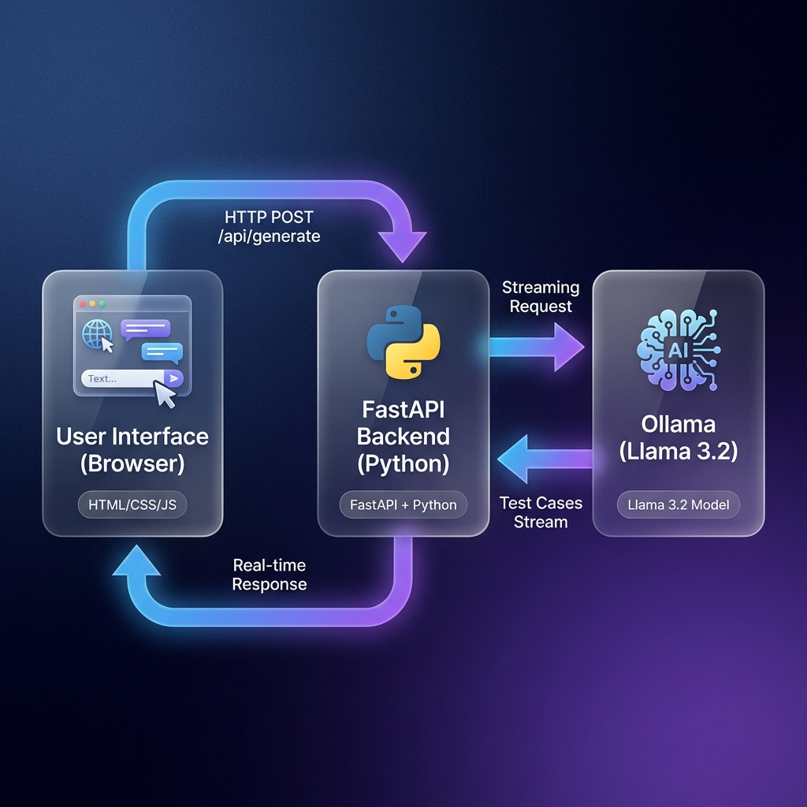

# 🤖 Ollama Test Generator

A local LLM-powered test case generator using Ollama (Llama 3.2) with a premium glassmorphic web interface. Generate comprehensive test cases from your code or requirements in real-time.



## ✨ Features

- 🤖 **Local LLM**: Uses Ollama (Llama 3.2) for intelligent test case generation
- 🎨 **Premium UI**: Beautiful glassmorphism design with dark mode
- ⚡ **Real-time Streaming**: Watch test cases being generated live
- 📋 **Structured Output**: Professional format with Test ID, Description, Steps, and Expected Results
- 🔒 **Privacy First**: All processing happens locally - no data sent to external APIs
- 🚀 **Fast & Efficient**: Leverages local GPU acceleration via Ollama

## 🏗️ Architecture

This project follows the **B.L.A.S.T.** protocol for reliable, deterministic automation:

### System Flow

```
┌─────────────────┐      HTTP POST        ┌──────────────────┐      Streaming      ┌─────────────────┐
│                 │   /api/generate       │                  │      Request        │                 │
│  User Interface │──────────────────────▶│  FastAPI Backend │────────────────────▶│ Ollama (Llama   │
│   (Browser)     │                       │    (Python)      │                     │     3.2)        │
│                 │◀──────────────────────│                  │◀────────────────────│                 │
│  HTML/CSS/JS    │   Real-time Response  │ FastAPI + Python │   Test Cases Stream │  Llama 3.2 Model│
└─────────────────┘                       └──────────────────┘                     └─────────────────┘
```

### 3-Layer Architecture (A.N.T.)

1. **Architecture Layer** (`architecture/`)
   - Technical SOPs defining goals, inputs, and logic
   - `generation_sop.md` - Test generation specifications

2. **Navigation Layer** (`app/main.py`)
   - FastAPI backend routing requests
   - Applies prompt templates to user input
   - Streams responses from Ollama

3. **Tools Layer** (`tools/`)
   - `check_ollama.py` - Health check and model verification
   - Deterministic, atomic scripts

## 🚀 Quick Start

### Prerequisites

- Python 3.8+
- [Ollama](https://ollama.ai/) installed and running
- Llama 3.2 model pulled

### Installation

1. **Clone the repository:**
```bash
git clone https://github.com/aman2743/tcgenerationllm.git
cd tcgenerationllm
```

2. **Install Python dependencies:**
```bash
pip install -r requirements.txt
```

3. **Install and start Ollama:**
```bash
# Install Ollama from https://ollama.ai/

# Pull the Llama 3.2 model
ollama pull llama3.2

# Start Ollama server
ollama serve
```

4. **Verify Ollama connection:**
```bash
python tools/check_ollama.py
```

Expected output:
```
✅ Ollama is RUNNING and reachable.
✅ Model 'llama3.2' found.
```

### Running the Application

**Option 1: Using the launcher script (Recommended)**
```bash
python run_app.py
```

**Option 2: Manual start**
```bash
# Terminal 1 - Backend
cd app
python main.py

# Terminal 2 - Frontend
cd frontend
python -m http.server 3000
```

Then open your browser to: **http://localhost:3000**

## 📁 Project Structure

```
tcgenerationllm/
├── app/
│   └── main.py                 # FastAPI backend server
├── frontend/
│   ├── index.html              # Main UI
│   ├── css/
│   │   └── style.css           # Glassmorphism styling
│   └── js/
│       └── app.js              # Frontend logic with streaming
├── architecture/
│   └── generation_sop.md       # Technical SOP for test generation
├── tools/
│   └── check_ollama.py         # Ollama health check utility
├── docs/
│   └── architecture_diagram.png # System architecture diagram
├── .gitignore                  # Git ignore rules
├── requirements.txt            # Python dependencies
├── run_app.py                  # Application launcher
├── BLAST.md                    # B.L.A.S.T. protocol documentation
├── gemini.md                   # Project constitution
├── task_plan.md                # Development phases
├── progress.md                 # Development progress log
└── README.md                   # This file
```

## 🎯 How It Works

1. **User Input**: Paste your code or requirements into the chat interface
2. **Template Application**: Backend wraps input with a structured prompt template
3. **LLM Processing**: Ollama (Llama 3.2) analyzes and generates test cases
4. **Streaming Response**: Test cases stream back to the UI in real-time
5. **Formatted Output**: Results displayed in a clean, readable format

### Test Case Format

Each generated test case follows this structure:

```
--------------------------------------------------
Test Case ID: TC001
Description: Verify login with valid credentials

Steps:
1. Navigate to login page
2. Enter valid username and password
3. Click login button

Expected Result: User successfully logged in and redirected to dashboard
--------------------------------------------------
```

## 🛠️ Tech Stack

| Component | Technology |
|-----------|-----------|
| Frontend | Vanilla HTML5, CSS3 (Glassmorphism), JavaScript (ES6+) |
| Backend | Python, FastAPI, Uvicorn |
| AI Model | Ollama (Llama 3.2) |
| Architecture | B.L.A.S.T. Protocol, A.N.T. 3-Layer |

## 🎨 UI Features

- **Glassmorphism Design**: Modern frosted glass effect with blur
- **Dark Mode**: Easy on the eyes with gradient backgrounds
- **Typing Indicators**: Visual feedback during generation
- **Auto-resize Input**: Textarea expands as you type
- **Smooth Animations**: Polished micro-interactions
- **Responsive Layout**: Works on desktop and tablet

## 📊 Development Methodology

Built using the **B.L.A.S.T.** protocol:

- ✅ **Blueprint**: Requirements and data schema defined
- ✅ **Link**: Ollama connectivity verified
- ✅ **Architect**: 3-layer architecture implemented
- ✅ **Stylize**: Premium UI/UX design applied
- ✅ **Trigger**: Ready for deployment

## 🔧 Configuration

### Changing the Model

Edit `app/main.py` to use a different Ollama model:

```python
class GenerateRequest(BaseModel):
    userInput: str
    model: str = "llama3.2"  # Change this to your preferred model
```

### Customizing the Prompt Template

Edit the `SYSTEM_PROMPT_TEMPLATE` in `app/main.py` to modify how test cases are generated.

## 🐛 Troubleshooting

**Issue**: "Could not connect to Ollama"
- **Solution**: Ensure Ollama is running (`ollama serve`)

**Issue**: "Model 'llama3.2' NOT found"
- **Solution**: Pull the model (`ollama pull llama3.2`)

**Issue**: Frontend shows JSON parsing error
- **Solution**: Refresh the browser (Ctrl+Shift+R) to clear cache

## 📝 License

MIT License - Feel free to use this project for personal or commercial purposes.

## 🤝 Contributing

Contributions are welcome! Please feel free to submit a Pull Request.

## 👨‍💻 Author

**Aman Kumar**
- GitHub: [@aman2743](https://github.com/aman2743)

## 🙏 Acknowledgments

- Built with [Ollama](https://ollama.ai/)
- Powered by [Llama 3.2](https://ai.meta.com/llama/)
- Developed using the B.L.A.S.T. protocol

---

**⭐ If you find this project useful, please consider giving it a star!**
